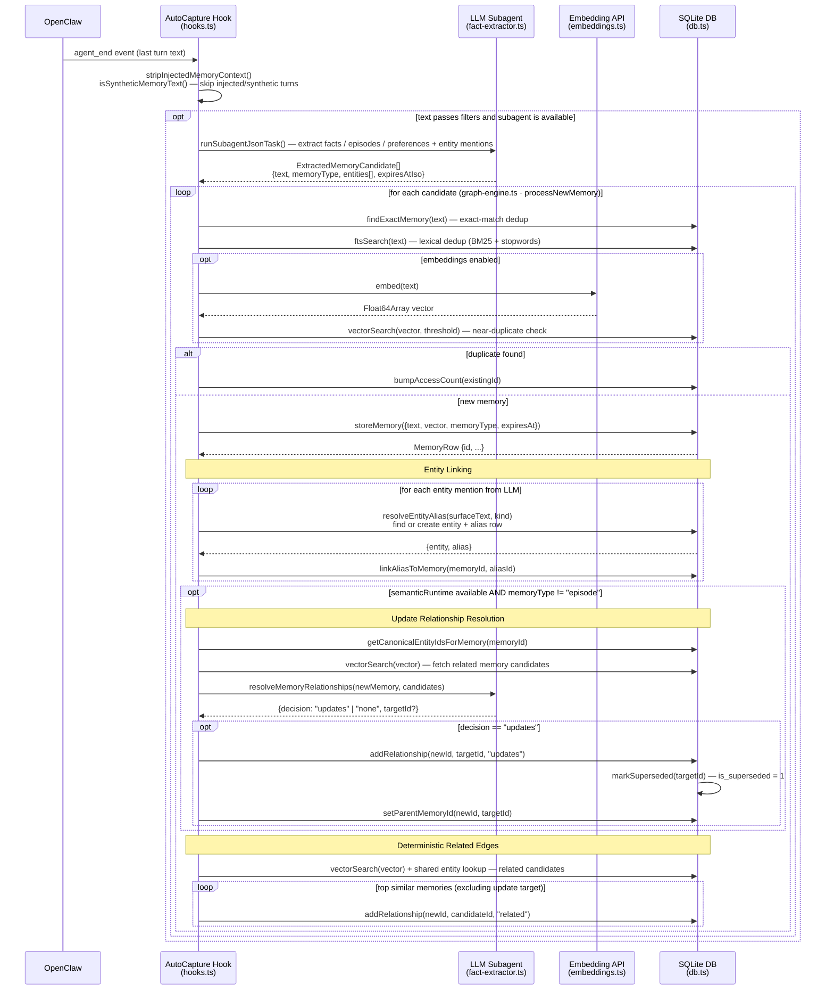

# Auto-Capture — Memory Extraction & Storage

Triggered by the `agent_end` lifecycle event after every AI response.

```mermaid
sequenceDiagram
    participant OC as OpenClaw
    participant Hook as AutoCapture Hook<br/>(hooks.ts)
    participant LLM as LLM Subagent<br/>(fact-extractor.ts)
    participant Emb as Embedding API<br/>(embeddings.ts)
    participant DB as SQLite DB<br/>(db.ts)

    OC->>Hook: agent_end event (last turn text)
    Hook->>Hook: stripInjectedMemoryContext()<br/>isSyntheticMemoryText() — skip injected/synthetic turns

    opt text passes filters and subagent is available
        Hook->>LLM: runSubagentJsonTask() — extract facts / episodes / preferences + entity mentions
        LLM-->>Hook: ExtractedMemoryCandidate[]<br/>{text, memoryType, entities[], expiresAtIso}

        loop for each candidate (graph-engine.ts · processNewMemory)
            Hook->>DB: findExactMemory(text) — exact-match dedup
            Hook->>DB: ftsSearch(text) — lexical dedup (BM25 + stopwords)

            opt embeddings enabled
                Hook->>Emb: embed(text)
                Emb-->>Hook: Float64Array vector
                Hook->>DB: vectorSearch(vector, threshold) — near-duplicate check
            end

            alt duplicate found
                Hook->>DB: bumpAccessCount(existingId)
            else new memory
                Hook->>DB: storeMemory({text, vector, memoryType, expiresAt})
                DB-->>Hook: MemoryRow {id, ...}

                Note over Hook,DB: Entity Linking
                loop for each entity mention from LLM
                    Hook->>DB: resolveEntityAlias(surfaceText, kind)<br/>find or create entity + alias row
                    DB-->>Hook: {entity, alias}
                    Hook->>DB: linkAliasToMemory(memoryId, aliasId)
                end

                opt semanticRuntime available AND memoryType != "episode"
                    Note over Hook,DB: Update Relationship Resolution
                    Hook->>DB: getCanonicalEntityIdsForMemory(memoryId)
                    Hook->>DB: vectorSearch(vector) — fetch related memory candidates
                    Hook->>LLM: resolveMemoryRelationships(newMemory, candidates)
                    LLM-->>Hook: {decision: "updates" | "none", targetId?}

                    opt decision == "updates"
                        Hook->>DB: addRelationship(newId, targetId, "updates")
                        DB->>DB: markSuperseded(targetId) — is_superseded = 1
                        Hook->>DB: setParentMemoryId(newId, targetId)
                    end
                end

                Note over Hook,DB: Deterministic Related Edges
                Hook->>DB: vectorSearch(vector) + shared entity lookup — related candidates
                loop top similar memories (excluding update target)
                    Hook->>DB: addRelationship(newId, candidateId, "related")
                end
            end
        end
    end
```
