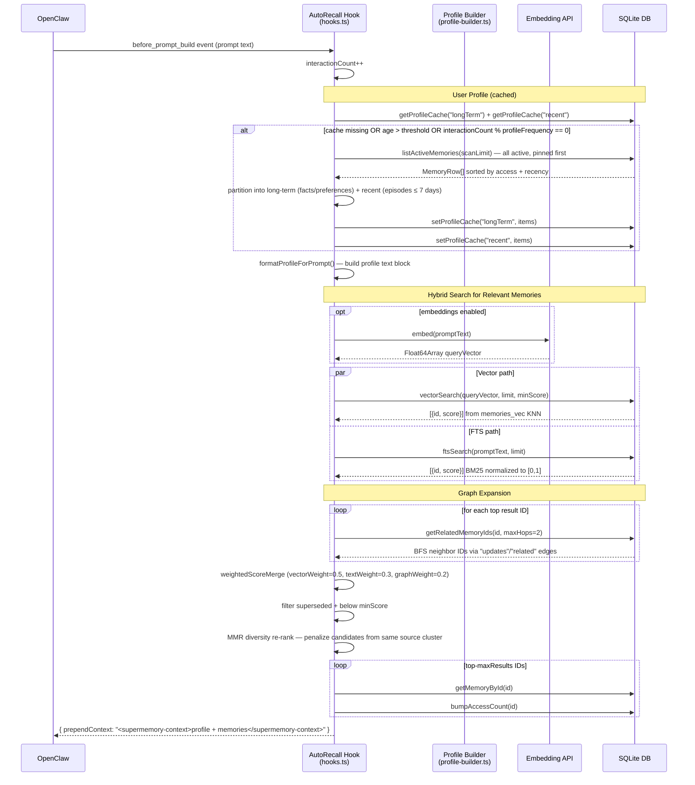

# Auto-Recall — Context Injection before each Turn

Triggered by the `before_prompt_build` lifecycle event before every AI turn.

```mermaid
sequenceDiagram
    participant OC as OpenClaw
    participant Hook as AutoRecall Hook<br/>(hooks.ts)
    participant PB as Profile Builder<br/>(profile-builder.ts)
    participant Emb as Embedding API
    participant DB as SQLite DB

    OC->>Hook: before_prompt_build event (prompt text)
    Hook->>Hook: interactionCount++

    Note over Hook,DB: User Profile (cached)
    Hook->>DB: getProfileCache("longTerm") + getProfileCache("recent")

    alt cache missing OR age > threshold OR interactionCount % profileFrequency == 0
        Hook->>DB: listActiveMemories(scanLimit) — all active, pinned first
        DB-->>Hook: MemoryRow[] sorted by access + recency
        Hook->>Hook: partition into long-term (facts/preferences) + recent (episodes ≤ 7 days)
        Hook->>DB: setProfileCache("longTerm", items)
        Hook->>DB: setProfileCache("recent", items)
    end

    Hook->>Hook: formatProfileForPrompt() — build profile text block

    Note over Hook,DB: Hybrid Search for Relevant Memories
    opt embeddings enabled
        Hook->>Emb: embed(promptText)
        Emb-->>Hook: Float64Array queryVector
    end

    par Vector path
        Hook->>DB: vectorSearch(queryVector, limit, minScore)
        DB-->>Hook: [{id, score}] from memories_vec KNN
    and FTS path
        Hook->>DB: ftsSearch(promptText, limit)
        DB-->>Hook: [{id, score}] BM25 normalized to [0,1]
    end

    Note over Hook,DB: Graph Expansion
    loop for each top result ID
        Hook->>DB: getRelatedMemoryIds(id, maxHops=2)
        DB-->>Hook: BFS neighbor IDs via "updates"/"related" edges
    end

    Hook->>Hook: weightedScoreMerge (vectorWeight=0.5, textWeight=0.3, graphWeight=0.2)
    Hook->>Hook: filter superseded + below minScore
    Hook->>Hook: MMR diversity re-rank — penalize candidates from same source cluster

    loop top-maxResults IDs
        Hook->>DB: getMemoryById(id)
        Hook->>DB: bumpAccessCount(id)
    end

    Hook-->>OC: { prependContext: "<supermemory-context>profile + memories</supermemory-context>" }
```
