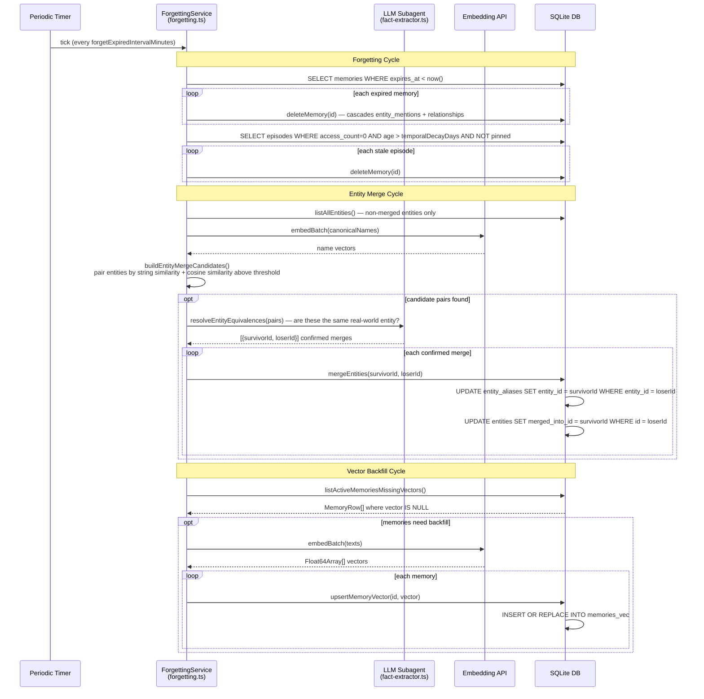

# Background Maintenance — ForgettingService

Runs on a periodic timer (default: every 60 minutes) independently of conversation activity.

```mermaid
sequenceDiagram
    participant Timer as Periodic Timer
    participant FS as ForgettingService<br/>(forgetting.ts)
    participant LLM as LLM Subagent<br/>(fact-extractor.ts)
    participant Emb as Embedding API
    participant DB as SQLite DB

    Timer->>FS: tick (every forgetExpiredIntervalMinutes)

    Note over FS,DB: Forgetting Cycle
    FS->>DB: SELECT memories WHERE expires_at < now()
    loop each expired memory
        FS->>DB: deleteMemory(id) — cascades entity_mentions + relationships
    end

    FS->>DB: SELECT episodes WHERE access_count=0 AND age > temporalDecayDays AND NOT pinned
    loop each stale episode
        FS->>DB: deleteMemory(id)
    end

    Note over FS,DB: Entity Merge Cycle
    FS->>DB: listAllEntities() — non-merged entities only
    FS->>Emb: embedBatch(canonicalNames)
    Emb-->>FS: name vectors

    FS->>FS: buildEntityMergeCandidates()<br/>pair entities by string similarity + cosine similarity above threshold

    opt candidate pairs found
        FS->>LLM: resolveEntityEquivalences(pairs) — are these the same real-world entity?
        LLM-->>FS: [{survivorId, loserId}] confirmed merges

        loop each confirmed merge
            FS->>DB: mergeEntities(survivorId, loserId)
            DB->>DB: UPDATE entity_aliases SET entity_id = survivorId WHERE entity_id = loserId
            DB->>DB: UPDATE entities SET merged_into_id = survivorId WHERE id = loserId
        end
    end

    Note over FS,DB: Vector Backfill Cycle
    FS->>DB: listActiveMemoriesMissingVectors()
    DB-->>FS: MemoryRow[] where vector IS NULL

    opt memories need backfill
        FS->>Emb: embedBatch(texts)
        Emb-->>FS: Float64Array[] vectors

        loop each memory
            FS->>DB: upsertMemoryVector(id, vector)
            DB->>DB: INSERT OR REPLACE INTO memories_vec
        end
    end
```
