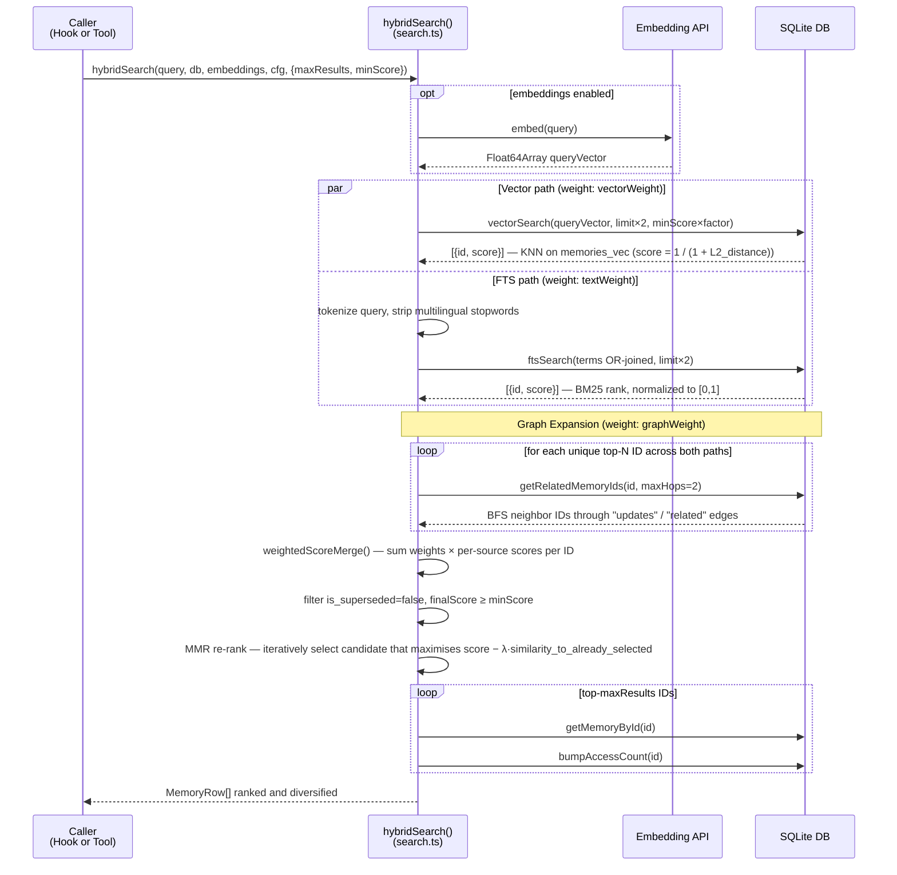

# Hybrid Search — memory_search Tool & Auto-Recall Detail

Used by both the `memory_search` tool and the auto-recall hook.

```mermaid
sequenceDiagram
    participant Caller as Caller<br/>(Hook or Tool)
    participant S as hybridSearch()<br/>(search.ts)
    participant Emb as Embedding API
    participant DB as SQLite DB

    Caller->>S: hybridSearch(query, db, embeddings, cfg, {maxResults, minScore})

    opt embeddings enabled
        S->>Emb: embed(query)
        Emb-->>S: Float64Array queryVector
    end

    par Vector path (weight: vectorWeight)
        S->>DB: vectorSearch(queryVector, limit×2, minScore×factor)
        DB-->>S: [{id, score}] — KNN on memories_vec (score = 1 / (1 + L2_distance))
    and FTS path (weight: textWeight)
        S->>S: tokenize query, strip multilingual stopwords
        S->>DB: ftsSearch(terms OR-joined, limit×2)
        DB-->>S: [{id, score}] — BM25 rank, normalized to [0,1]
    end

    Note over S,DB: Graph Expansion (weight: graphWeight)
    loop for each unique top-N ID across both paths
        S->>DB: getRelatedMemoryIds(id, maxHops=2)
        DB-->>S: BFS neighbor IDs through "updates" / "related" edges
    end

    S->>S: weightedScoreMerge() — sum weights × per-source scores per ID
    S->>S: filter is_superseded=false, finalScore ≥ minScore
    S->>S: MMR re-rank — iteratively select candidate that maximises score − λ·similarity_to_already_selected

    loop top-maxResults IDs
        S->>DB: getMemoryById(id)
        S->>DB: bumpAccessCount(id)
    end

    S-->>Caller: MemoryRow[] ranked and diversified
```
