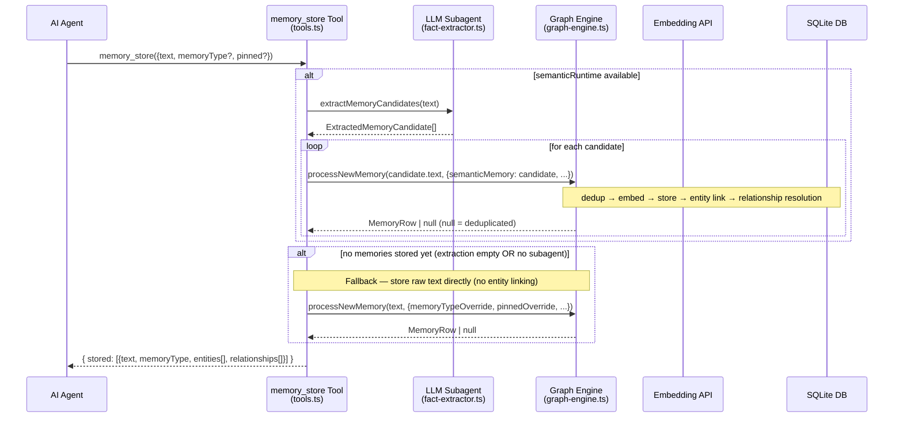

# memory_store Tool — Manual Memory Storage

Called explicitly by the AI agent when it decides to save something.

```mermaid
sequenceDiagram
    participant Agent as AI Agent
    participant Tool as memory_store Tool<br/>(tools.ts)
    participant LLM as LLM Subagent<br/>(fact-extractor.ts)
    participant GE as Graph Engine<br/>(graph-engine.ts)
    participant Emb as Embedding API
    participant DB as SQLite DB

    Agent->>Tool: memory_store({text, memoryType?, pinned?})

    alt semanticRuntime available
        Tool->>LLM: extractMemoryCandidates(text)
        LLM-->>Tool: ExtractedMemoryCandidate[]

        loop for each candidate
            Tool->>GE: processNewMemory(candidate.text, {semanticMemory: candidate, ...})
            Note over GE,DB: dedup → embed → store → entity link → relationship resolution
            GE-->>Tool: MemoryRow | null (null = deduplicated)
        end
    end

    alt no memories stored yet (extraction empty OR no subagent)
        Note over Tool,GE: Fallback — store raw text directly (no entity linking)
        Tool->>GE: processNewMemory(text, {memoryTypeOverride, pinnedOverride, ...})
        GE-->>Tool: MemoryRow | null
    end

    Tool-->>Agent: { stored: [{text, memoryType, entities[], relationships[]}] }
```
